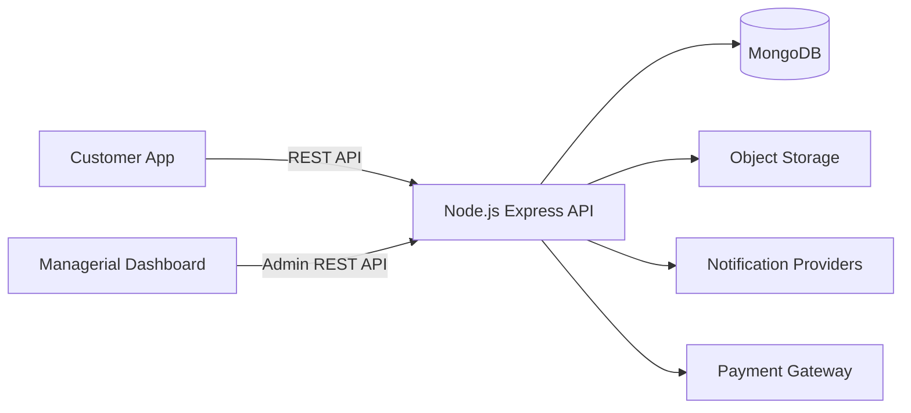

# BuiltGlory Documentation

This folder contains the product and engineering contract for BuiltGlory customer app and managerial dashboard communication with the planned Node.js, Express.js, and MongoDB backend.

## Current State

The repository currently contains:

- `BuiltGlory-App`: Expo React Native customer app prototype.
- `builtglory-frontend-1.1`: Vite React managerial dashboard prototype.

The repository does not currently contain:

- Backend source code.
- MongoDB models or migrations.
- A generated OpenAPI/Swagger document.
- Production authentication, payment, upload, or notification integrations.

Because of that, these docs separate current frontend/mock-derived behavior from target backend specifications.

## Documents

- [API Contract](api-contract.md)
  - Frontend-backend API contract for customer app and managerial dashboard.
  - Includes auth, common response shapes, customer APIs, admin APIs, OpenAPI guidance, and open contract decisions.
- [Screen Endpoint Map](screen-endpoint-map.md)
  - Screen-by-screen endpoint usage for the customer app and managerial dashboard routes.
  - Explains which API each screen uses and for what purpose during frontend integration.
- [Database Schema](database-schema.md)
  - Target MongoDB collections, fields, relationships, indexes, lifecycle enums, and integrity rules.
- [Business Rules](business-rules.md)
  - Product logic, validations, lifecycle transitions, role rules, KYC/FEMA, payment, SLA, audit, and notification rules.
- [Architecture Design](architecture-design.md)
  - Technical implementation design for Expo app, Vite dashboard, Express backend, MongoDB, uploads, notifications, payments, observability, security, and deployment.

## System Boundary

## Source Evidence Used

Customer app:

- `BuiltGlory-App/src/navigation/registry.tsx`
- `BuiltGlory-App/src/screens/`
- `BuiltGlory-App/src/data/data.ts`
- `BuiltGlory-App/src/state/AppState.tsx`

Managerial dashboard:

- `builtglory-frontend-1.1/src/routes/adminRoutes.tsx`
- `builtglory-frontend-1.1/src/config/adminNavigation.ts`
- `builtglory-frontend-1.1/src/mock/`
- `builtglory-frontend-1.1/src/pages/auth/LoginPage.tsx`
- `builtglory-frontend-1.1/src/components/admin/AdminLayout.tsx`
- `builtglory-frontend-1.1/src/lib/utils.ts`

## Recommended Reading Order

1. Start with [Architecture Design](architecture-design.md) to understand the system boundary.
2. Read [API Contract](api-contract.md) to align frontend-backend communication.
3. Use [Screen Endpoint Map](screen-endpoint-map.md) as the app/dashboard integration checklist.
4. Read [Database Schema](database-schema.md) to understand persistence and relationships.
5. Read [Business Rules](business-rules.md) to confirm logic, validations, and operational workflows.

## Quality Notes

- Backend details are proposed target specifications where implementation is absent.
- Entity names and statuses are aligned with current frontend mock data.
- Critical validations are documented as backend-enforced rules, even if the current prototype only validates them in the UI.
- Open decisions are listed explicitly instead of being hidden as assumptions.
