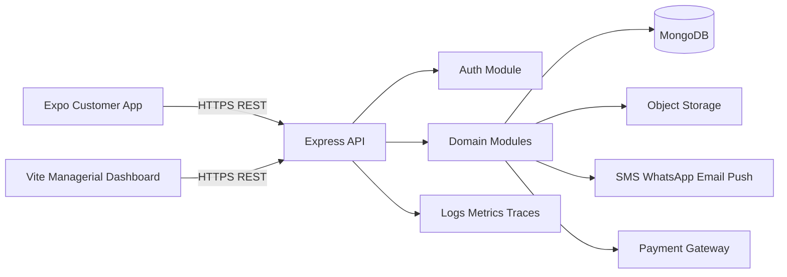
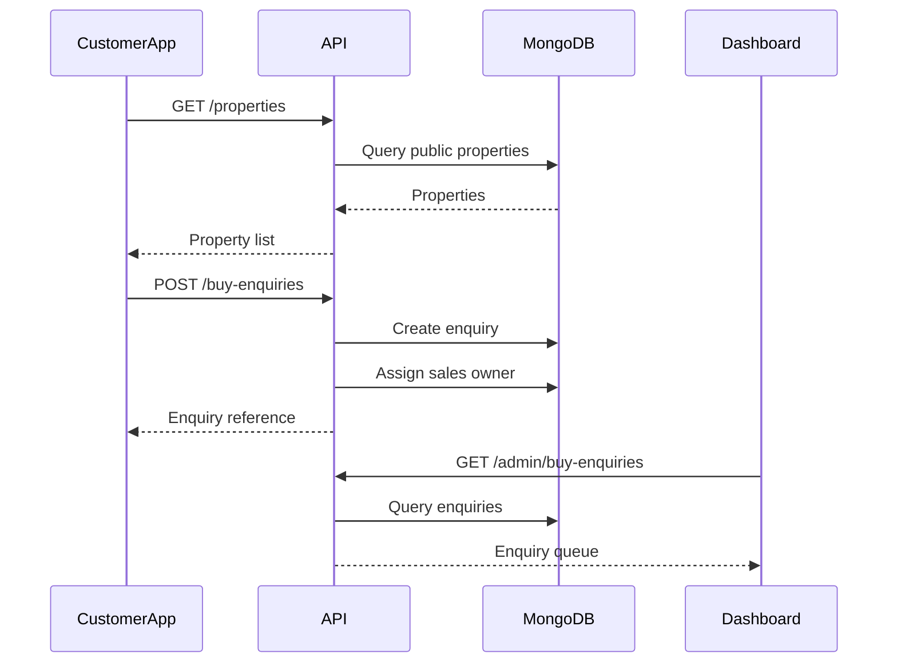
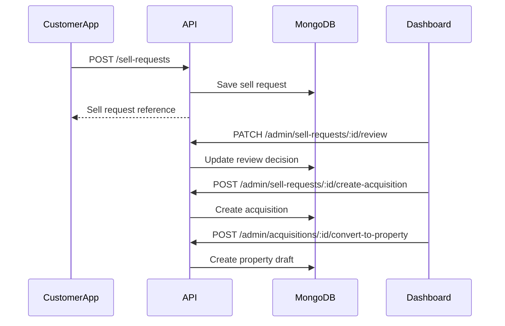
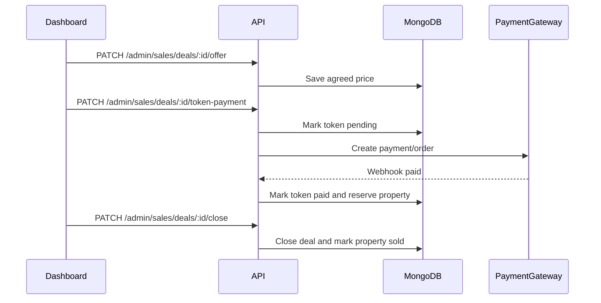

# BuiltGlory Architecture Design

## Purpose

This document defines the technical architecture for BuiltGlory, covering the customer app, managerial dashboard, Node.js/Express.js backend, MongoDB database, authentication, uploads, notifications, observability, and deployment.

## Current Repository State

The workspace currently contains two frontend projects:

- Customer app: `BuiltGlory-App`
  - Expo React Native.
  - Local mock/sample data.
  - Screen registry includes authentication, buy flow, sell flow, profile, settings, support, global states, and extras.
- Managerial dashboard: `builtglory-frontend-1.1`
  - Vite + React + TypeScript.
  - Admin routes for enquiries, acquisition, sales, properties, users, reports, tools, settings, and support.
  - Mock data files define the current domain model.

Missing from this workspace:

- Backend source code.
- Database schema/migrations.
- Real OpenAPI/Swagger spec.
- Production auth provider.
- Real payment, upload, notification, and analytics integrations.

## Target Architecture



Target stack:

- Customer app: Expo React Native.
- Dashboard: React + Vite + TypeScript.
- Backend: Node.js + Express.js.
- Database: MongoDB.
- ODM/data layer: Mongoose or typed MongoDB repository layer.
- API documentation: OpenAPI 3.1 served by backend.
- Authentication: JWT access tokens plus refresh tokens.
- File storage: S3-compatible object storage.
- Notifications: FCM/APNs, SMS, WhatsApp, and email providers.
- Payments: gateway such as Razorpay or equivalent, to be confirmed.

## System Responsibilities

### Customer App

Responsibilities:

- Onboarding and phone OTP login.
- Profile setup and account settings.
- Property discovery, filters, favorites, comparison, and map views.
- Buy enquiries and visit scheduling.
- NRI video assistance and document access.
- Payment initiation and status viewing.
- Sell request creation, drafts, edits, and seller dashboard.
- Seller offers, negotiation, payment schedule, registration, and completion.
- Customer support, callbacks, notifications, and FAQ/help content.

Should not own:

- Authorization decisions.
- Payment truth.
- KYC/FEMA approval.
- Listing publication approval.
- Deal closure state.
- Any business rule that affects money, legal status, or inventory.

### Managerial Dashboard

Responsibilities:

- Operational overview.
- Buy enquiry review and assignment.
- Sell request review and acquisition conversion.
- Acquisition pipeline management.
- Sales pipeline management.
- Property inventory management.
- User/KYC/FEMA review.
- Visit, callback, chat, interior lead, and support queues.
- Reports and exports.
- Admin settings, role access, and audit trail.

Should not own:

- Business truth in local state.
- Hardcoded credentials in production.
- Direct database access from browser.
- Financial state changes without backend audit.

### Backend API

Responsibilities:

- Authentication and session lifecycle.
- Request validation.
- Business rule enforcement.
- Role and permission checks.
- MongoDB persistence.
- File upload orchestration.
- Payment gateway integration and webhook verification.
- Notification dispatch.
- Audit logging.
- OpenAPI/Swagger contract.
- Aggregations for dashboard reports.

## Backend Module Design

Suggested structure:

```text
backend/
  src/
    app.ts
    server.ts
    config/
      env.ts
      database.ts
      storage.ts
    middleware/
      auth.ts
      permissions.ts
      validate.ts
      errorHandler.ts
      requestLogger.ts
      rateLimit.ts
    modules/
      auth/
      users/
      admins/
      properties/
      buyEnquiries/
      sellRequests/
      acquisitions/
      salesDeals/
      visits/
      callbacks/
      chatThreads/
      interiorLeads/
      supportTickets/
      payments/
      documents/
      notifications/
      reports/
      auditLogs/
    shared/
      db/
      errors/
      ids/
      openapi/
      pagination/
      storage/
      time/
```

Recommended module pattern:

```text
modules/properties/
  property.model.ts
  property.schema.ts
  property.routes.ts
  property.controller.ts
  property.service.ts
  property.repository.ts
  property.openapi.ts
```

Layer responsibilities:

- Routes: Express route definitions and middleware.
- Controller: request parsing and response shaping.
- Service: business logic and state transitions.
- Repository: MongoDB reads/writes.
- Schema: validation and OpenAPI shape.
- Model: Mongoose model or typed collection definition.

## API Boundary

The backend exposes one versioned REST API:

```text
/api/v1
```

Public/customer route examples:

- `/auth/customer/otp/send`
- `/auth/customer/otp/verify`
- `/me`
- `/properties`
- `/buy-enquiries`
- `/visits`
- `/sell-requests`
- `/callbacks`
- `/support/tickets`

Admin route examples:

- `/admin/overview`
- `/admin/properties`
- `/admin/users`
- `/admin/buy-enquiries`
- `/admin/sell-requests`
- `/admin/acquisitions`
- `/admin/sales/deals`
- `/admin/visits`
- `/admin/callbacks`
- `/admin/negotiations/chats`
- `/admin/interior/leads`
- `/admin/support/tickets`
- `/admin/audit-logs`

OpenAPI endpoints:

- `/openapi.json`
- `/api-docs`

## Data Flow: Customer Buy Journey



## Data Flow: Sell To Acquisition



## Data Flow: Sales Closure



## Authentication Architecture

Customer:

- OTP issue and verify through backend.
- Access token: short lived.
- Refresh token: longer lived and revocable.
- Device metadata stored for risk checks.

Admin:

- Email/password login.
- Password hashing with bcrypt or argon2.
- 30-minute inactivity timeout.
- Role and permission claims in access token.
- Permission checks on backend for every admin route.

Session storage:

- Customer app stores tokens in secure storage.
- Dashboard stores access token in memory where possible and refresh token in secure HTTP-only cookie if deployed under same domain. If not possible, use carefully managed storage plus XSS protection.

## Authorization Architecture

Use permission-based access, not only role labels.

Example:

```json
{
  "role": "sales_manager",
  "permissions": [
    "sales.read",
    "sales.write",
    "enquiries.read",
    "enquiries.write",
    "visits.read",
    "visits.write"
  ]
}
```

Rules:

- Customer APIs can access only the logged-in customer's records unless explicitly public.
- Admin APIs require admin token.
- Admin mutation APIs require explicit write permissions.
- Financial, legal, and closure actions require elevated permissions.
- Every admin mutation writes an audit log.

## MongoDB Architecture

Collections:

- `users`
- `admins`
- `properties`
- `buyEnquiries`
- `sellRequests`
- `acquisitions`
- `salesDeals`
- `visits`
- `callbacks`
- `chatThreads`
- `interiorLeads`
- `supportTickets`
- `payments`
- `documents`
- `auditLogs`

Design choices:

- Embed small arrays that are naturally owned by a document, such as KYC document summaries, callback attempts, visit notes, and stage history.
- Reference high-level entities such as users, properties, deals, and acquisitions by ObjectId.
- Store denormalized snapshots for operational history, such as buyer name and property title inside enquiries/deals.
- Use indexes for all dashboard queues and SLA queries.
- Use transactions for multi-document financial and inventory state changes where available.

Transaction examples:

- Token payment paid:
  - update payment
  - update sales deal
  - reserve property
  - write audit log
- Deal closure:
  - close sales deal
  - mark property sold
  - close enquiry
  - write audit log
- Acquisition conversion:
  - mark acquisition acquired
  - create property draft
  - write audit log

## File Upload Architecture

Upload flow:

1. Client requests upload intent from backend.
2. Backend validates user, purpose, file type, and size.
3. Backend returns signed upload URL or accepts multipart upload.
4. File is stored in object storage.
5. Backend creates `documents` metadata record.
6. Virus scan runs before approval/public use.
7. Backend attaches document/media reference to the owning entity.

Storage categories:

- Public property media.
- Private KYC documents.
- Private legal documents.
- Private payment proofs.
- Support attachments.

Rules:

- KYC, legal, and payment documents must not be publicly accessible.
- Public property media should use CDN URLs.
- File deletion should be soft-delete metadata first, then lifecycle cleanup from storage.

## Notification Architecture

Notification providers:

- Push: FCM/APNs.
- SMS: provider to be selected.
- WhatsApp: provider to be selected.
- Email: provider to be selected.

Backend design:

- Create notification event.
- Render template with safe variables.
- Dispatch through configured provider.
- Store delivery status and provider response.
- Retry transient failures.

Events:

- OTP sent.
- Enquiry created.
- Visit scheduled/confirmed/rescheduled/cancelled.
- Sell request approved/rejected/change requested.
- Offer received or accepted.
- Token payment created/paid/failed.
- KYC approved/rejected.
- Callback assigned/overdue.
- Support ticket response.

## Payment Architecture

Payment gateway is not selected in the repo. Target design should support a gateway such as Razorpay.

Payment principles:

- Backend creates payment orders.
- Client never decides payment success.
- Gateway webhook is source of truth.
- Webhook signatures must be verified.
- Payment APIs must be idempotent.
- Payment status changes must write audit logs.
- Deal/property state changes caused by payments should happen in a transaction.

Payment states:

- `created`
- `pending`
- `paid`
- `failed`
- `refunded`
- `cancelled`

## Dashboard Architecture

Current dashboard:

- React Router route tree under `/admin`.
- Sidebar and tabs from `adminNavigation`.
- Demo auth from `LoginPage`.
- Layout handles redirect and 30-minute inactivity timeout.
- Mock files drive pages.

Target dashboard changes:

- Replace mock imports with API client modules.
- Centralize API calls under a dashboard `src/lib/api` or domain-specific service layer.
- Use `VITE_API_URL` as the base URL.
- Add token refresh and `401` handling.
- Add route/element-level permission checks.
- Replace hardcoded badges with API counts.
- Keep optimistic UI limited to low-risk edits only.

Suggested dashboard API client:

```text
builtglory-frontend-1.1/src/lib/api/
  client.ts
  auth.ts
  properties.ts
  users.ts
  enquiries.ts
  sellRequests.ts
  acquisitions.ts
  sales.ts
  visits.ts
  callbacks.ts
  support.ts
```

## Customer App Architecture

Current customer app:

- Expo React Native.
- Screen registry pattern.
- Local sample data in `src/data/data.ts`.
- Local favorite state in `src/state/AppState.tsx`.

Target customer app changes:

- Replace static data reads with API hooks/services.
- Persist auth tokens in secure storage.
- Persist favorites through backend.
- Move form submissions to backend endpoints.
- Add loading, error, offline, and retry states around API calls.
- Use upload APIs for photos/documents.
- Use push notification registration.

Suggested customer API client:

```text
BuiltGlory-App/src/api/
  client.ts
  auth.ts
  properties.ts
  enquiries.ts
  visits.ts
  sellRequests.ts
  profile.ts
  support.ts
  payments.ts
```

## Error Handling

Backend:

- Throw typed domain errors.
- Return consistent error payloads.
- Log unexpected errors with request ID.
- Never leak stack traces in production.

Frontend:

- Show field-level validation where possible.
- Show retry options for network failures.
- Redirect to login on expired session.
- Preserve form drafts during transient API failures.

## Observability

Minimum production observability:

- Structured logs with request ID.
- API latency metrics.
- Error rate metrics.
- MongoDB query performance monitoring.
- Payment webhook logs.
- Notification delivery logs.
- Audit trail for admin actions.
- Health checks:
  - `/health`
  - `/ready`

Recommended alerts:

- API error rate spike.
- MongoDB connection failure.
- Payment webhook failures.
- OTP provider failures.
- Notification provider failures.
- SLA queue growth for callbacks and support.

## Security

Required controls:

- HTTPS everywhere.
- CORS allowlist for dashboard and app origins.
- Helmet or equivalent secure headers.
- Rate limits on auth, OTP, uploads, and public APIs.
- Request body size limits.
- Input validation on every write.
- No secrets in frontend bundles.
- Password hashes only.
- File type and size validation.
- Private storage for sensitive documents.
- Audit all admin mutations.
- Principle of least privilege for admin permissions.

Sensitive data:

- Phone numbers.
- Email addresses.
- KYC documents.
- FEMA notes.
- Payment records.
- Legal documents.

## Deployment Architecture

Suggested environments:

- `development`
- `staging`
- `production`

Backend deployment:

- Node.js service deployed to Render, Railway, AWS ECS, Fly.io, or similar.
- MongoDB Atlas with environment-specific clusters/databases.
- Object storage bucket per environment.
- Secrets managed outside git.

Frontend deployment:

- Dashboard built with Vite and deployed as static app.
- Customer app delivered through Expo/EAS builds and app stores.

CI/CD checks:

- TypeScript compile.
- Lint.
- Unit tests.
- API contract generation validation.
- Backend route/schema tests.
- Build dashboard.
- Build or type-check app.

## Implementation Phases

### Phase 1: Backend Foundation

- Express app setup.
- MongoDB connection.
- Environment config.
- Error handling.
- Request logging.
- Validation middleware.
- OpenAPI generation.
- Auth scaffolding.

### Phase 2: Core Domain APIs

- Users and admin auth.
- Properties.
- Buy enquiries.
- Sell requests.
- Visits.
- Callbacks.

### Phase 3: Operational Pipelines

- Acquisition pipeline.
- Sales pipeline.
- Negotiation chats.
- Interior leads.
- Support tickets.
- Audit logs.

### Phase 4: Integrations

- File uploads.
- OTP provider.
- Payment gateway.
- Push/SMS/WhatsApp/email notifications.
- Reports and exports.

### Phase 5: Frontend Integration

- Dashboard API client.
- Customer app API client.
- Replace mock data module by module.
- Add loading/error/empty states.
- Add permission-aware dashboard UI.

## Quality Gates

Before production:

- Every write endpoint has validation tests.
- Every lifecycle transition has service-level tests.
- Every admin write emits audit logs.
- Payment webhooks have signature tests.
- OTP flows have rate-limit tests.
- File upload restrictions are tested.
- Dashboard and app can run against staging APIs.
- OpenAPI docs match implemented routes.
- MongoDB indexes are created and verified.

## Open Architecture Decisions

- Hosting provider for backend.
- Payment gateway provider.
- OTP/SMS/WhatsApp provider.
- Object storage provider.
- Whether dashboard auth uses HTTP-only cookies or token storage strategy based on deployment domain.
- Whether to use Mongoose or direct MongoDB driver with custom repositories.
- Whether chat messages stay embedded or move to separate `chatMessages` collection.
