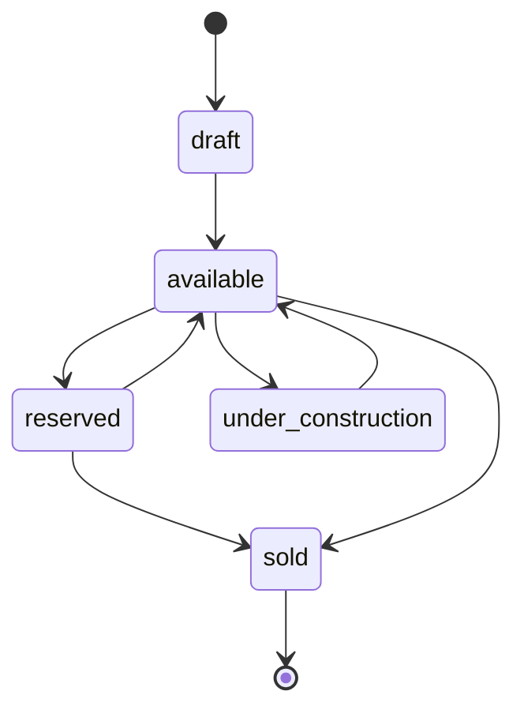
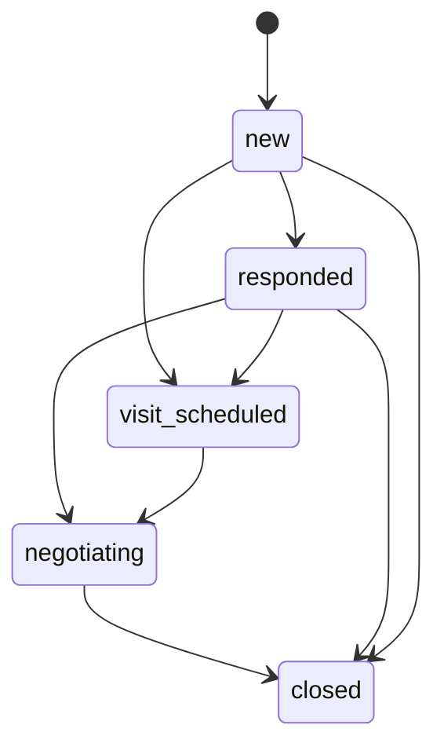
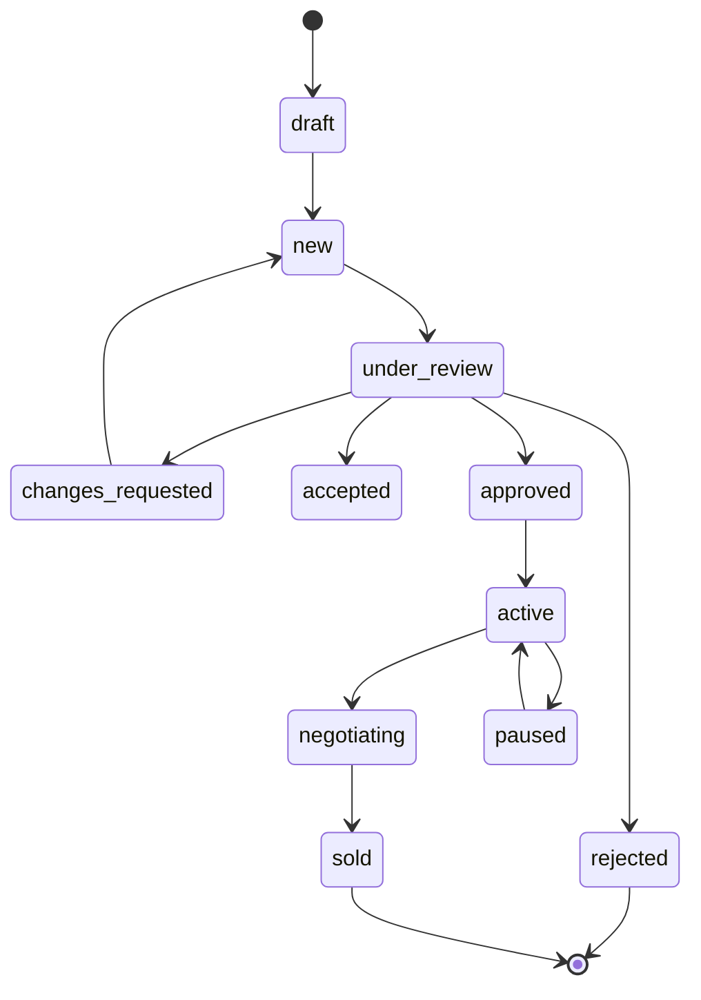
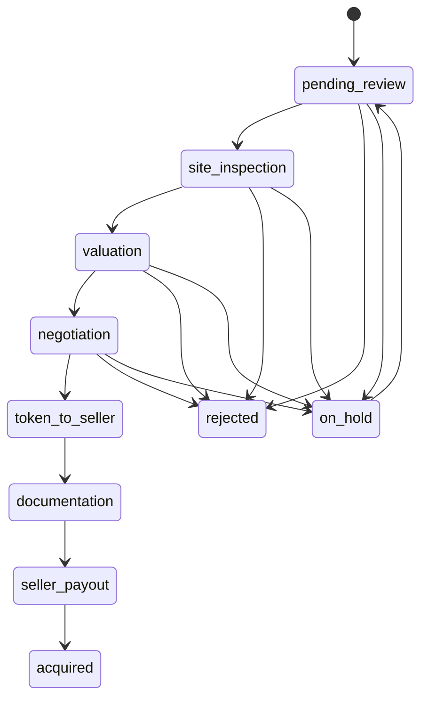
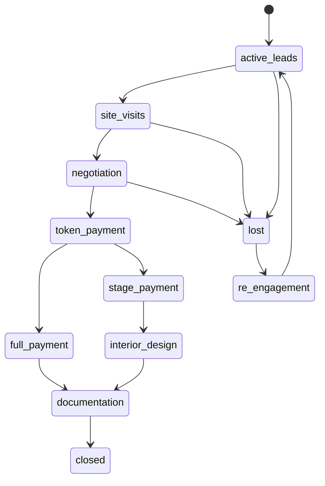

# BuiltGlory Business Rules

## Purpose

This document defines logic, validations, permissions, lifecycle transitions, and operational rules for the BuiltGlory customer app and managerial dashboard.

Current implementation note:

- The customer app and dashboard currently enforce many rules only in UI state and mock data.
- Production must enforce all critical rules in the Node.js/Express.js backend and MongoDB validations.
- Frontend validation is for user experience; backend validation is the source of truth.

## User Categories

Customer user types:

- `resident`: India-resident customer.
- `nri`: non-resident Indian customer.
- `pio`: person of Indian origin customer.

Customer roles:

- `buyer`: can browse, save, enquire, schedule visits, negotiate, pay, and complete purchase.
- `seller`: can submit sell requests, manage listings, receive offers, and complete seller-side sale flow.
- `both`: can use buyer and seller flows.

Admin roles:

- `super_admin`: full dashboard access and destructive/high-risk approvals.
- `admin`: operational manager access excluding sensitive platform settings unless granted.
- `operations`: acquisition, visits, callbacks, document follow-up, and listing operations.
- `support`: support tickets, callbacks, and customer communication.
- `sales_manager`: sales pipeline and team assignment.
- `sales_executive`: assigned enquiries, visits, deals, and negotiation actions.
- `relationship_manager`: customer relationship and NRI/PIO assistance.
- `designer`: interior lead assignment and quote workflow.

## Global Validation Rules

### Identity And Contact

- Indian phone numbers must contain exactly 10 digits after removing non-digits.
- Store normalized phone as country code plus digits.
- Email is optional for customers but must be valid when provided.
- Customer profile name must be at least 2 characters.
- Admin email is required and must be unique.
- Admin password must be stored as a hash and never returned from APIs.

### Date And Time

- Store all timestamps in UTC ISO 8601.
- User-facing date/time should render in the user's selected locale/time zone.
- Visit and callback preferred times cannot be in the past.
- Relative visit slots become stale:
  - `tomorrow_morning` and `tomorrow_afternoon` become stale after 1 day from submission.
  - `this_weekend_morning` and `this_weekend_afternoon` become stale after 7 days from submission.

### Money

- All backend money fields must be numeric.
- Display formatting belongs to clients.
- Payment mutation APIs must be idempotent.
- Payment webhooks must verify provider signatures.
- Deal amounts cannot be negative.
- `agreedPrice` cannot exceed business-approved max variance unless overridden by authorized admin.

### Files

- Uploads must be scanned for malware before operational approval.
- Supported document file types should include PDF, JPG, JPEG, and PNG.
- Supported media file types should include JPG, JPEG, PNG, WEBP, and MP4 where needed.
- KYC, legal, and payment files must be private by default.
- Property marketing photos can be public only after listing approval.

## Customer Authentication Rules

Current behavior:

- Customer app uses phone OTP screens.
- Demo OTP is `123456`.
- Phone input accepts only digits and requires 10 digits.
- OTP resend timer is 60 seconds.

Target backend rules:

- OTP must expire after a short configurable period, default 5 minutes.
- Resend is blocked until resend cooldown ends, default 60 seconds.
- Lock verification after too many failed attempts, default 5 attempts per OTP request.
- Rate-limit OTP issue by phone, device, and IP.
- Customer sessions should use access and refresh tokens.
- Refresh tokens must be revocable.
- Do not log OTP values.

## Admin Authentication Rules

Current behavior:

- Dashboard has hardcoded demo credentials.
- Auth session is stored in `localStorage` under `builtglory-admin-auth`.
- Dashboard redirects unauthenticated users to `/login`.
- Inactivity timeout is 30 minutes.

Target backend rules:

- Admin authentication must use backend-issued tokens.
- Admin password must be hashed with bcrypt or argon2.
- Failed admin login attempts should be rate-limited.
- Admin sessions expire after 30 minutes of inactivity by default.
- Admin logout revokes refresh tokens.
- Permission checks must happen on every admin API mutation.
- All admin mutations must write audit logs.

## Property Rules

Property statuses:

- `draft`
- `available`
- `reserved`
- `under_construction`
- `sold`

Property source:

- `acquired`
- `manual`
- `bulk_upload`

Publication rules:

- Only `available`, `reserved`, and `under_construction` properties may appear in customer-facing lists.
- `draft` properties are dashboard-only.
- `sold` properties should not appear in default browse lists but may appear in history or comparable-sales contexts.
- `isDeleted = true` properties must not be returned to customer APIs.
- `isFeatured` and `isUpcoming` are editorial flags and require admin permission.
- Upcoming properties require a `launchDate`.
- Public listings require:
  - title
  - description
  - property type
  - city
  - locality
  - pincode
  - price
  - at least one cover photo
  - status
  - basic specifications appropriate to type

Property media rules:

- First approved property photo becomes cover photo unless admin sets a different one.
- Floor plan, 3D tour, drone image/video, and video URLs are optional.
- Media cannot be public until the property is approved for publication.

Property status transition rules:

Backend enforcement:

- `sold` requires a closed sales deal.
- `reserved` requires a token-paid deal or admin override.
- `draft` cannot become `available` until required fields pass validation.
- `soldAt` is set when status becomes `sold`.
- Reopening `sold` requires `super_admin` approval and audit note.

## Buyer Enquiry Rules

Statuses:

- `new`
- `responded`
- `visit_scheduled`
- `negotiating`
- `closed`

Interest types:

- `schedule_visit`
- `price_negotiation`
- `more_details`

Preferred contact:

- `phone`
- `whatsapp`
- `email`

Creation rules:

- Customer must be authenticated.
- Property must exist and be visible.
- A blocked customer cannot create an enquiry.
- If `interestType = schedule_visit`, a visit preference is required.
- If `preferredContact = email`, customer email must exist.
- Additional message is optional but should be length-limited.

Duplicate detection:

- A duplicate enquiry exists when the same normalized phone enquires on the same property more than once.
- The oldest matching enquiry is treated as original.
- Duplicates are allowed but must be flagged for the dashboard to avoid repeated follow-up.

Transition rules:

Backend enforcement:

- Converting to sales deal requires property availability.
- One active sales deal per enquiry.
- Closed enquiries are read-only except admin notes.

## Visit Rules

Visit statuses:

- `scheduled`
- `confirmed`
- `completed`
- `cancelled`
- `missed`
- `rescheduled`

Visit types:

- `physical`
- `virtual`

Scheduling rules:

- Customer must be authenticated.
- Property must be visible and not sold.
- Visit date/time must be in the future.
- Admin confirmation is required before a visit becomes `confirmed`.
- Physical visits require property location.
- Virtual visits require platform and meeting link before confirmation.
- NRI/PIO users should default to virtual assistance when appropriate.

Reschedule rules:

- Reschedules append immutable history with previous date/time, new date/time, reason, and actor.
- `rescheduleCount` increments on every reschedule.
- Excessive reschedules should be flagged for manager review.

Completion rules:

- Completed visits require feedback.
- Feedback must include buyer interest, notes, next action, and completion timestamp.
- If next action is `move_to_negotiation`, backend may create or update a sales deal.
- If next action is `mark_lost`, the linked sales deal may move to `lost`.

## Sell Request Rules

Statuses:

- `draft`
- `new`
- `under_review`
- `accepted`
- `approved`
- `active`
- `negotiating`
- `paused`
- `sold`
- `rejected`
- `changes_requested`

Current customer app validations:

- Basic details require property title, BHK, built-up area, floor, total floors, and age for apartment-style flow.
- Location requires building/society and 6-digit pincode.
- Photo upload requires at least 5 photos.
- Price is required before review/submission.

Target backend validations:

- Seller must be authenticated and not blocked.
- Seller role must be `seller` or `both`.
- `propertyType`, title, address, pincode, asking price, and ownership type are required.
- `pincode` must be 6 digits.
- Asking price must be positive.
- At least 5 photos are required for submission, but not for draft.
- At least one ownership/legal document should be required before approval.
- KYC must be verified before a sell request can become `approved` or `active`.
- If `loanOnProperty = true`, loan details and supporting documents are required.

Draft rules:

- Drafts can be saved with incomplete data.
- Drafts store `draftStep` and `draftSavedAt`.
- Drafts are visible only to the seller and authorized admins.

Review rules:

- New submission enters `new` or `under_review`.
- Admin can approve, reject, accept for acquisition, or request changes.
- Rejection requires `rejectionReason`.
- `changes_requested` requires at least one change request note.
- Seller can edit only `draft` and `changes_requested` requests.

Transition rules:

## Acquisition Pipeline Rules

Stages:

- `pending_review`
- `site_inspection`
- `valuation`
- `negotiation`
- `token_to_seller`
- `documentation`
- `seller_payout`
- `acquired`
- `rejected`
- `on_hold`

Creation rules:

- Acquisition can be created from approved/accepted sell request or manually by authorized admin.
- A sell request can have only one active acquisition.
- Seller KYC must be visible on acquisition detail.

Stage rules:

- `pending_review`: initial review of seller request, completeness, KYC, and property basics.
- `site_inspection`: requires scheduled/completed site inspection details.
- `valuation`: requires valuation amount and notes before moving forward.
- `negotiation`: stores BuiltGlory offer, seller counter, agreed price, and negotiation notes.
- `token_to_seller`: requires agreed price.
- `documentation`: requires legal checklist and document verification.
- `seller_payout`: requires final purchase price and payout account details.
- `acquired`: requires completed payout and completed documentation.
- `rejected`: requires rejection reason.
- `on_hold`: requires hold reason.

Transition rules:

Post-acquisition rules:

- `acquired` can create a property with `source = acquired`.
- The created property starts as `draft` until media and listing fields pass property publication rules.
- Final purchase price must be immutable after acquired unless `super_admin` approves correction.

## Sales Pipeline Rules

Stages:

- `active_leads`
- `site_visits`
- `negotiation`
- `token_payment`
- `full_payment`
- `stage_payment`
- `interior_design`
- `documentation`
- `closed`
- `lost`
- `re_engagement`

Creation rules:

- Sales deal can be created from buyer enquiry, visit feedback, chat negotiation, or manual admin action.
- Buyer and property are required.
- Property must not be sold.
- A property may have many active leads, but only one reserved/token-paid buyer at a time unless overridden.

Financial rules:

- `offeredPrice` can be null until negotiation.
- `agreedPrice` is required before token payment.
- `tokenAmount` is required before token payment can be marked paid.
- `tokenPaid = true` should reserve the property.
- `paymentType` must be `full` or `stage` after token payment.
- `totalPaid` cannot exceed agreed price.
- Closed deal requires full payment or approved stage payment completion rule.

Transition rules:

Closure rules:

- `closed` requires buyer KYC verified.
- NRI/PIO closure requires FEMA compliance status `compliant`.
- `closedAt` is set automatically.
- Linked property becomes `sold`.
- Linked enquiry becomes `closed`.

Lost rules:

- `lostReason` is required.
- Re-engagement requires follow-up date.
- Re-engagement attempts should be counted.

## Negotiation Chat Rules

Chat statuses:

- `active`
- `deal_agreed`
- `lost`
- `inactive`

Message types:

- `text`
- `offer`
- `deal_agreed`

Offer statuses:

- `pending`
- `accepted`
- `countered`
- `declined`

Rules:

- Only authenticated buyer and authorized admins can access a thread.
- Offer messages require `offerAmount`.
- Accepted offer sets negotiation agreed price.
- Countering an offer marks prior offer `countered` and creates a new offer.
- Deal-agreed message can create or update sales deal negotiation stage.
- Long negotiations are flagged after 14 days.
- Deadlines within 2 days should be highlighted.

## Callback Rules

Statuses:

- `pending`
- `called`
- `resolved`
- `missed`
- `rescheduled`
- `overdue`

SLA rules:

- Every callback has `slaDeadline`.
- A callback becomes `overdue` when unresolved after `slaDeadline`.
- Attempt count increments on every call attempt.
- Rescheduling requires a new preferred time and reason.
- Resolution requires notes.

Attempt outcomes:

- `answered`
- `no_answer`
- `busy`
- `wrong_number`
- `callback_later`

Backend rules:

- `wrong_number` should flag user contact verification.
- `callback_later` should require reschedule.
- `answered` can move callback to `called` or `resolved` depending on notes.

## Interior Lead Rules

Statuses:

- `new`
- `contacted`
- `quote_sent`
- `accepted`
- `negotiating`
- `declined`
- `completed`

Rules:

- Interior lead requires buyer, property, selected rooms, design style, and budget range.
- New leads require SLA deadline, default 24 hours from submission.
- `quote_sent` requires quote amount, package name, timeline, inclusions, and quote validity date.
- `accepted` requires customer acceptance timestamp.
- `completed` requires delivery/completion note.
- NRI/PIO interior leads should be eligible for remote coordination notes.

## Support Ticket Rules

Statuses:

- `open`
- `in_progress`
- `resolved`
- `closed`

Priorities:

- `low`
- `medium`
- `high`
- `urgent`

Rules:

- New ticket starts as `open`.
- First admin response can move ticket to `in_progress`.
- `resolved` requires resolution response.
- `closed` should happen after customer confirmation or auto-close window.
- Urgent tickets should appear at the top of support queues.
- Tickets with no response after SLA threshold should be overdue.
- Escalation requires target assignee and reason.

## KYC And FEMA Rules

KYC statuses:

- `not_submitted`
- `pending`
- `verified`
- `rejected`

KYC document statuses:

- `missing`
- `uploaded`
- `verified`
- `rejected`
- `expired`

Rules:

- Customer can upload KYC documents.
- Admin verifies or rejects each document.
- Rejected document requires rejection reason.
- User `kycStatus` is:
  - `not_submitted` when no required documents are uploaded.
  - `pending` when required documents are uploaded but not fully verified.
  - `verified` when all required documents are verified.
  - `rejected` when one or more required documents are rejected and no replacement is pending.
- Buyer KYC is required before deal closure.
- Seller KYC is required before sell request approval or acquisition payout.

FEMA:

- FEMA applies to `nri` and `pio` users.
- NRI/PIO users default to `not_checked`.
- FEMA warning should show when status is `not_checked` or `non_compliant`.
- Deal closure for NRI/PIO requires `compliant` unless `super_admin` override is explicitly logged.

## Role And Permission Rules

Minimum permission model:

- `properties.read`: view properties.
- `properties.write`: create/update properties.
- `properties.publish`: publish or feature properties.
- `users.read`: view users.
- `users.kyc.review`: approve/reject KYC.
- `users.fema.review`: update FEMA.
- `enquiries.read`: view enquiries.
- `enquiries.write`: update enquiry status and assignment.
- `acquisitions.read`: view acquisition pipeline.
- `acquisitions.write`: update acquisition stages.
- `sales.read`: view sales pipeline.
- `sales.write`: update deal stages and financials.
- `support.read`: view tickets/callbacks.
- `support.write`: respond and resolve.
- `admin.access.manage`: manage admin users and roles.
- `audit.read`: view audit trail.

Rules:

- Read and write permissions are separate.
- Financial and closure actions require elevated permissions.
- Permission denial returns `403`.
- All admin writes must include actor, resource, before, after, and timestamp in audit logs.

## Reporting Rules

Dashboard reports should be generated from source collections, not manually edited metrics.

Core metrics:

- Active properties.
- Featured/upcoming properties.
- New enquiries.
- Visit conversion rate.
- Acquisition stage aging.
- Sales stage aging.
- Token-paid deals.
- Closed deals.
- Revenue.
- Overdue callbacks.
- Open support tickets.

Rules:

- Reports must filter by date range.
- Export should be permission-controlled.
- Export files should expire after a configured retention period.

## Notification Rules

Current behavior:

- Dashboard includes TODOs for real FCM/APNs push calls.

Target rules:

- Notifications are created for important lifecycle events:
  - OTP sent.
  - Enquiry created.
  - Visit scheduled/confirmed/rescheduled/cancelled.
  - Sell request submitted/approved/rejected/change requested.
  - Offer received.
  - Token payment status changed.
  - KYC approved/rejected.
  - Support response added.
- Notification channels: push, SMS, WhatsApp, email, in-app.
- Marketing messages require opt-in and unsubscribe handling.
- Transactional notifications should not depend on marketing opt-in.

## Audit Rules

Audit is required for:

- Admin login/logout.
- Permission changes.
- User block/unblock.
- KYC/FEMA updates.
- Property create/update/status changes.
- Sell request review decisions.
- Acquisition stage changes.
- Sales deal financial changes.
- Payment status changes.
- Support escalation.
- Bulk messaging.

Audit records are immutable and should not be editable from the dashboard.

## Open Business Decisions

- Exact SLA thresholds for enquiries, callbacks, visits, support tickets, and interior leads.
- Final role-permission matrix for managerial users.
- Payment gateway and finance approval flow.
- Legal checklist fields for acquisition and sales documentation.
- Required KYC documents by user type and transaction type.
- FEMA compliance checklist details.
- Whether BuiltGlory buys properties directly first or supports marketplace seller-buyer closure in parallel.
