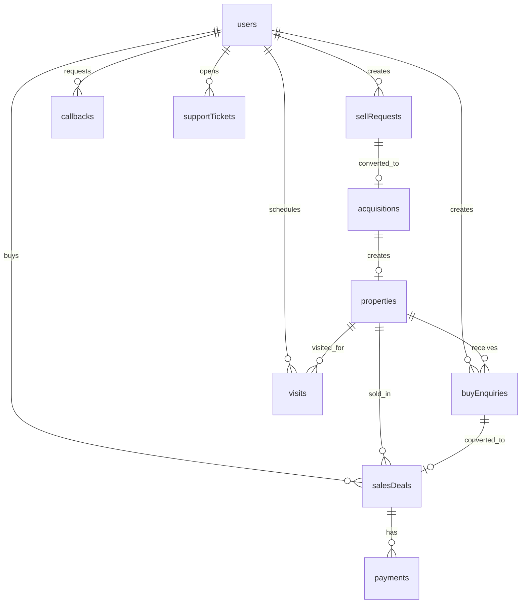

# BuiltGlory Database Schema

## Purpose

This document defines the target MongoDB data model for the BuiltGlory Node.js/Express.js backend. It covers customer-facing app data and managerial dashboard operations.

The current repo does not include database migrations or backend models. This schema is derived from frontend mock models and app workflows, then normalized into production-ready MongoDB collections.

## Database Choice

Target database:

- MongoDB Atlas or self-managed MongoDB replica set.
- ODM: Mongoose or a typed MongoDB driver layer.
- Primary ID: MongoDB `_id`.
- Public ID: `referenceId` for support, operations, and customer-visible tracking.
- Timestamps: all collections include `createdAt` and `updatedAt`.
- Soft delete: operational collections should prefer `isDeleted`, `deletedAt`, and `deletedBy` over hard delete.

## Naming Standards

- Collection names use plural camelCase: `sellRequests`, `salesDeals`.
- Status fields use snake_case string enums.
- Foreign keys use ObjectId references plus optional denormalized display fields when dashboard list views need fast reads.
- Public references use stable prefixes:
  - `USER-001`
  - `PROP-001`
  - `BG-ENQ-2026-001`
  - `BG-SELL-2026-001`
  - `BG-ACQ-2026-001`
  - `BG-DEAL-2026-001`
  - `BG-VST-2026-001`
  - `BG-CB-2026-001`

## Relationship Overview



## Core Collections

## `users`

Stores customer accounts for buyers, sellers, and users who are both.

Source evidence: `builtglory-frontend-1.1/src/mock/users.ts`.

Important enums:

- `userType`: `resident`, `nri`, `pio`
- `role`: `buyer`, `seller`, `both`
- `kycStatus`: `not_submitted`, `pending`, `verified`, `rejected`
- `femaCompliance.status`: `not_checked`, `compliant`, `non_compliant`, `under_review`

Schema:

```json
{
  "_id": "ObjectId",
  "referenceId": "USER-001",
  "name": "Arjun Mehta",
  "phone": "+91 98765 43210",
  "phoneNormalized": "919876543210",
  "email": "arjun@example.com",
  "userType": "resident",
  "role": "buyer",
  "profilePhoto": "https://cdn.example.com/users/usr_001.jpg",
  "city": "Bangalore",
  "state": "Karnataka",
  "country": "India",
  "kycStatus": "verified",
  "kycDocuments": [
    {
      "_id": "ObjectId",
      "name": "PAN Card",
      "type": "pan",
      "status": "verified",
      "fileUrl": "https://cdn.example.com/kyc/pan.pdf",
      "uploadedAt": "2026-05-29T10:00:00.000Z",
      "verifiedAt": "2026-05-30T10:00:00.000Z",
      "verifiedBy": "ObjectId",
      "rejectionReason": null
    }
  ],
  "kycSubmittedAt": "2026-05-29T10:00:00.000Z",
  "kycVerifiedAt": "2026-05-30T10:00:00.000Z",
  "kycRejectionReason": null,
  "femaCompliance": {
    "status": "not_checked",
    "checkedBy": null,
    "checkedAt": null,
    "notes": null
  },
  "totalEnquiries": 3,
  "totalVisits": 2,
  "totalDeals": 1,
  "totalListings": 0,
  "registeredAt": "2026-05-29T10:00:00.000Z",
  "lastLoginAt": "2026-06-20T10:00:00.000Z",
  "isActive": true,
  "isBlocked": false,
  "blockedReason": null,
  "assignedTo": "ObjectId",
  "createdAt": "2026-05-29T10:00:00.000Z",
  "updatedAt": "2026-06-20T10:00:00.000Z"
}
```

Indexes:

- Unique: `phoneNormalized`
- Unique sparse: `email`
- Unique: `referenceId`
- Compound: `{ role: 1, userType: 1, kycStatus: 1 }`
- Compound: `{ isBlocked: 1, isActive: 1 }`
- Text: `name`, `phone`, `email`, `referenceId`

## `admins`

Stores managerial dashboard users.

Roles:

- `super_admin`
- `admin`
- `operations`
- `support`
- `sales_manager`
- `sales_executive`
- `relationship_manager`
- `designer`

Schema:

```json
{
  "_id": "ObjectId",
  "name": "Arjun Kapoor",
  "email": "admin@builtglory.com",
  "passwordHash": "bcrypt_hash",
  "role": "super_admin",
  "permissions": ["properties.read", "properties.write"],
  "phone": "+91 98765 55555",
  "assignedArea": ["Whitefield", "Marathahalli"],
  "specialization": [],
  "activeWorkload": 8,
  "isAvailable": true,
  "isActive": true,
  "lastLoginAt": "2026-06-20T10:00:00.000Z",
  "createdAt": "2026-05-29T10:00:00.000Z",
  "updatedAt": "2026-06-20T10:00:00.000Z"
}
```

Indexes:

- Unique: `email`
- Compound: `{ role: 1, isActive: 1, isAvailable: 1 }`

## `properties`

Stores public and operational property listings.

Source evidence: `builtglory-frontend-1.1/src/mock/properties.ts` and `BuiltGlory-App/src/data/data.ts`.

Important enums:

- `status`: `available`, `sold`, `reserved`, `under_construction`, `draft`
- `source`: `acquired`, `manual`, `bulk_upload`
- `type`: `plot`, `apartment`, `residential`, `commercial`, `organic_home`, `3d_printing`, `fractional`, `ceo_mansion`, `holiday_home`, `land`, `farmhouse`, `nri`, `interior`, `villa`

Schema:

```json
{
  "_id": "ObjectId",
  "referenceId": "PROP-001",
  "title": "Luxury Apartment, Indiranagar",
  "description": "Verified apartment with legal checks.",
  "type": "apartment",
  "status": "available",
  "source": "manual",
  "isFeatured": true,
  "isUpcoming": false,
  "address": {
    "line1": "Building / street",
    "line2": null,
    "locality": "Indiranagar",
    "city": "Bangalore",
    "state": "Karnataka",
    "pincode": "560038",
    "landmark": null,
    "latitude": 12.9716,
    "longitude": 77.6412
  },
  "price": 4500000,
  "isNegotiable": true,
  "specs": {
    "bhk": "3 BHK",
    "builtUpArea": 1450,
    "carpetArea": 1180,
    "plotArea": null,
    "floor": "4",
    "totalFloors": 8,
    "facing": "East",
    "age": "3-5 yrs",
    "furnishing": "Semi-Furnished",
    "parking": "Covered",
    "reraNumber": "K-RERA-PRJ-00001",
    "possession": "Ready to Move",
    "vastuCompliant": true,
    "transactionType": "resale"
  },
  "amenities": ["Lift", "Parking", "Security"],
  "media": {
    "photos": ["https://cdn.example.com/properties/prop_001/1.jpg"],
    "coverPhoto": "https://cdn.example.com/properties/prop_001/cover.jpg",
    "videoUrl": null,
    "droneImageUrl": null,
    "tour3dUrl": null,
    "floorPlanUrl": null
  },
  "advantages": {
    "investment": ["High rental demand"],
    "location": ["Near metro"],
    "connectivity": ["Outer Ring Road access"]
  },
  "nearbyPlaces": [
    {
      "name": "Indiranagar Metro",
      "type": "metro",
      "distance": "1.2 km"
    }
  ],
  "highlights": ["Verified", "Ready to move"],
  "metrics": {
    "savedCount": 36,
    "views": 1284,
    "enquiries": 36,
    "visits": 7,
    "compareCount": 5
  },
  "savedByUsers": ["ObjectId"],
  "assignedTo": "ObjectId",
  "sourceSheet": null,
  "acquisitionId": "ObjectId",
  "launchDate": null,
  "possessionDate": null,
  "soldAt": null,
  "isDeleted": false,
  "deletedAt": null,
  "deletedBy": null,
  "createdAt": "2026-05-29T10:00:00.000Z",
  "updatedAt": "2026-06-20T10:00:00.000Z"
}
```

Indexes:

- Unique: `referenceId`
- Compound: `{ status: 1, type: 1, "address.city": 1 }`
- Compound: `{ isFeatured: 1, status: 1 }`
- Compound: `{ isUpcoming: 1, launchDate: 1 }`
- Geospatial: `{ "address.location": "2dsphere" }` if location is stored as GeoJSON.
- Text: `title`, `description`, `address.locality`, `address.city`, `referenceId`

## `buyEnquiries`

Stores buyer interest, visit requests, negotiation requests, and more-details requests.

Source evidence: `builtglory-frontend-1.1/src/mock/enquiries.ts`.

Important enums:

- `status`: `new`, `responded`, `visit_scheduled`, `negotiating`, `closed`
- `preferredContact`: `phone`, `whatsapp`, `email`
- `interestType`: `schedule_visit`, `price_negotiation`, `more_details`
- `preferredVisitTime`: `tomorrow_morning`, `tomorrow_afternoon`, `this_weekend_morning`, `this_weekend_afternoon`, `custom`, `null`

Schema:

```json
{
  "_id": "ObjectId",
  "referenceId": "BG-ENQ-2026-001",
  "buyerId": "ObjectId",
  "buyerSnapshot": {
    "name": "Rajesh Kumar",
    "phone": "+91 98765 43210",
    "email": "rajesh@example.com",
    "userType": "resident"
  },
  "propertyId": "ObjectId",
  "propertySnapshot": {
    "title": "Luxury Apartment, Indiranagar",
    "price": 4500000,
    "type": "apartment",
    "location": "Indiranagar, Bangalore"
  },
  "enquiryTypes": ["Schedule Visit"],
  "preferredContact": "whatsapp",
  "interestType": "schedule_visit",
  "preferredVisitTime": "tomorrow_morning",
  "preferredVisitDate": null,
  "preferredVisitTimeSlot": "10:00 AM - 12:00 PM",
  "additionalMessage": "Looking for 3BHK with good ventilation",
  "status": "new",
  "source": "app",
  "assignedTo": "ObjectId",
  "duplicateOf": null,
  "submittedAt": "2026-05-29T10:30:00.000Z",
  "createdAt": "2026-05-29T10:30:00.000Z",
  "updatedAt": "2026-05-29T10:30:00.000Z"
}
```

Indexes:

- Unique: `referenceId`
- Compound: `{ propertyId: 1, buyerId: 1, submittedAt: -1 }`
- Compound: `{ status: 1, assignedTo: 1 }`
- Compound: `{ submittedAt: -1 }`

## `sellRequests`

Stores seller-submitted listings and drafts before acquisition or listing approval.

Source evidence: `builtglory-frontend-1.1/src/mock/sellRequests.ts`.

Important enums:

- `status`: `draft`, `new`, `under_review`, `accepted`, `approved`, `active`, `negotiating`, `paused`, `sold`, `rejected`, `changes_requested`
- `document.status`: `uploaded`, `missing`, `pending`
- `sellerKycStatus`: `verified`, `pending`, `rejected`

Schema:

```json
{
  "_id": "ObjectId",
  "referenceId": "BG-SELL-2026-001",
  "sellerId": "ObjectId",
  "sellerSnapshot": {
    "name": "Sunita Reddy",
    "phone": "+91 98123 45678",
    "email": "sunita@example.com",
    "userType": "resident",
    "kycStatus": "verified"
  },
  "propertyTitle": "Residential Plot in Sarjapur Road",
  "propertyType": "plot",
  "askingPrice": 4200000,
  "negotiable": true,
  "address": {
    "street": "Sy.No. 45/2, Sarjapur Road",
    "locality": "Sarjapur Road",
    "city": "Bangalore",
    "state": "Karnataka",
    "pincode": "560035",
    "landmark": "Near Wipro SEZ",
    "latitude": 12.9102,
    "longitude": 77.6853
  },
  "ownershipType": "Freehold",
  "possessionStatus": "Immediate",
  "loanOnProperty": false,
  "photos": ["https://cdn.example.com/sell/sell_001/1.jpg"],
  "photosCount": 5,
  "documentsCount": 2,
  "completenessPercent": 75,
  "description": "DTCP-approved residential plot.",
  "amenities": [],
  "specifications": {
    "plotArea": "1200 sqft",
    "dimensions": "30 x 40 ft",
    "facing": "North"
  },
  "documents": [
    {
      "name": "Sale Deed",
      "status": "uploaded",
      "fileUrl": "https://cdn.example.com/docs/sale-deed.pdf"
    }
  ],
  "status": "new",
  "isDraft": false,
  "draftStep": null,
  "draftSavedAt": null,
  "assignedTo": "ObjectId",
  "rejectionReason": null,
  "pauseReason": null,
  "metrics": {
    "views": 20,
    "enquiryCount": 0,
    "visitCount": 0,
    "saveCount": 0,
    "viewsThisWeek": [12, 8, 15, 22, 18, 9, 14]
  },
  "sale": {
    "salePrice": null,
    "saleDate": null,
    "buyerName": null
  },
  "submittedAt": "2026-05-29T10:30:00.000Z",
  "createdAt": "2026-05-29T10:30:00.000Z",
  "updatedAt": "2026-05-29T10:30:00.000Z"
}
```

Indexes:

- Unique: `referenceId`
- Compound: `{ sellerId: 1, status: 1 }`
- Compound: `{ status: 1, assignedTo: 1, submittedAt: -1 }`
- Compound: `{ "address.city": 1, propertyType: 1 }`

## `acquisitions`

Stores the operational pipeline for BuiltGlory buying/acquiring seller assets.

Source evidence: `builtglory-frontend-1.1/src/mock/acquisitions.ts`.

Important enums:

- `stage`: `pending_review`, `site_inspection`, `valuation`, `negotiation`, `token_to_seller`, `documentation`, `seller_payout`, `acquired`, `rejected`, `on_hold`
- `priority`: `normal`, `high`, `urgent`
- `createdFrom`: `sell_request`, `manual`

Schema:

```json
{
  "_id": "ObjectId",
  "referenceId": "BG-ACQ-2026-001",
  "stage": "pending_review",
  "createdFrom": "sell_request",
  "sellRequestId": "ObjectId",
  "sellerId": "ObjectId",
  "sellerSnapshot": {
    "name": "Sunita Reddy",
    "phone": "+91 98123 45678",
    "email": "sunita@example.com",
    "kycStatus": "verified",
    "userType": "resident"
  },
  "propertyTitle": "3BHK Apartment, Whitefield",
  "propertyType": "apartment",
  "propertyLocation": "Whitefield, Bangalore",
  "propertyCity": "Bangalore",
  "askingPrice": 6500000,
  "builtgloryOffer": null,
  "agreedPrice": null,
  "finalPurchasePrice": null,
  "assignedTo": "ObjectId",
  "priority": "normal",
  "daysInStage": 3,
  "lastActivityAt": "2026-05-29T08:00:00.000Z",
  "photos": ["https://cdn.example.com/acq/acq_001/1.jpg"],
  "media": {
    "videoUrl": null,
    "droneVideoUrl": null,
    "tourUrl3D": null,
    "floorPlanUrl": null
  },
  "propertyDetails": {},
  "rejectionReason": null,
  "onHoldReason": null,
  "stageHistory": [
    {
      "from": null,
      "to": "pending_review",
      "changedBy": "ObjectId",
      "changedAt": "2026-05-26T08:00:00.000Z",
      "notes": "Created from sell request."
    }
  ],
  "createdAt": "2026-05-26T08:00:00.000Z",
  "updatedAt": "2026-05-29T08:00:00.000Z"
}
```

Indexes:

- Unique: `referenceId`
- Compound: `{ stage: 1, priority: 1, assignedTo: 1 }`
- Compound: `{ sellRequestId: 1 }`
- Compound: `{ lastActivityAt: -1 }`

## `salesDeals`

Stores the sales pipeline for buyer conversion and payment closure.

Source evidence: `builtglory-frontend-1.1/src/mock/sales.ts`.

Important enums:

- `stage`: `active_leads`, `site_visits`, `negotiation`, `token_payment`, `full_payment`, `stage_payment`, `interior_design`, `documentation`, `closed`, `lost`, `re_engagement`
- `priority`: `normal`, `high`, `urgent`
- `buyerType`: `resident`, `nri`, `pio`
- `paymentType`: `full`, `stage`, `null`

Schema:

```json
{
  "_id": "ObjectId",
  "referenceId": "BG-DEAL-2026-001",
  "stage": "active_leads",
  "priority": "high",
  "buyerId": "ObjectId",
  "buyerSnapshot": {
    "name": "Rajesh Kumar",
    "phone": "+91 98111 22334",
    "email": "rajesh@example.com",
    "userType": "resident"
  },
  "propertyId": "ObjectId",
  "propertySnapshot": {
    "title": "2BHK Apartment, Whitefield",
    "type": "apartment",
    "location": "Whitefield, Bangalore",
    "price": 6200000
  },
  "financials": {
    "offeredPrice": null,
    "agreedPrice": null,
    "tokenAmount": null,
    "tokenPaid": false,
    "paymentType": null,
    "totalPaid": 0
  },
  "daysInStage": 2,
  "lastActivityAt": "2026-05-28T09:00:00.000Z",
  "assignedTo": "ObjectId",
  "sourceEnquiryId": "ObjectId",
  "lostReason": null,
  "closedAt": null,
  "reengagement": {
    "followUpAt": null,
    "lastContactAt": null,
    "attempts": 0
  },
  "photos": ["https://cdn.example.com/properties/prop_101/cover.jpg"],
  "stageHistory": [],
  "createdAt": "2026-05-26T08:00:00.000Z",
  "updatedAt": "2026-05-28T09:00:00.000Z"
}
```

Indexes:

- Unique: `referenceId`
- Compound: `{ stage: 1, priority: 1, assignedTo: 1 }`
- Compound: `{ buyerId: 1, createdAt: -1 }`
- Compound: `{ propertyId: 1, stage: 1 }`
- Compound: `{ sourceEnquiryId: 1 }`

## `visits`

Stores physical and virtual property visits.

Source evidence: `builtglory-frontend-1.1/src/mock/visits.ts`.

Important enums:

- `status`: `scheduled`, `confirmed`, `completed`, `cancelled`, `missed`, `rescheduled`
- `visitType`: `physical`, `virtual`
- `virtualPlatform`: `zoom`, `google_meet`, `teams`, `whatsapp_video`, `null`
- `buyerInterest`: `very_interested`, `interested`, `not_interested`, `needs_time`
- `nextAction`: `move_to_negotiation`, `schedule_another_visit`, `mark_lost`, `follow_up`

Indexes:

- Unique: `referenceId`
- Compound: `{ visitDate: 1, status: 1, assignedAdmin: 1 }`
- Compound: `{ buyerId: 1, visitDate: -1 }`
- Compound: `{ propertyId: 1, visitDate: -1 }`

## `callbacks`

Stores customer callback requests and call attempts.

Source evidence: `builtglory-frontend-1.1/src/mock/callbacks.ts`.

Important enums:

- `status`: `pending`, `called`, `resolved`, `missed`, `rescheduled`, `overdue`
- `userType`: `buyer`, `seller`, `nri`
- `source`: `help_support`, `profile_support`
- `category`: `property_inquiry`, `pricing`, `technical_issue`, `complaint`, `general`, `stage_payment`, `interior`
- `bestTimePreference`: `morning`, `afternoon`, `evening`
- `attempt.outcome`: `answered`, `no_answer`, `busy`, `wrong_number`, `callback_later`

Indexes:

- Unique: `referenceId`
- Compound: `{ status: 1, slaDeadline: 1 }`
- Compound: `{ assignedTo: 1, status: 1 }`
- Compound: `{ userId: 1, createdAt: -1 }`

## `chatThreads`

Stores negotiation chat threads and embedded messages.

Source evidence: `builtglory-frontend-1.1/src/mock/chats.ts`.

Important enums:

- `status`: `active`, `deal_agreed`, `lost`, `inactive`
- `message.sender`: `buyer`, `admin`
- `message.type`: `text`, `offer`, `deal_agreed`
- `message.offerStatus`: `pending`, `accepted`, `countered`, `declined`

Design note:

- Embed messages for normal-sized negotiation threads.
- If threads are expected to grow beyond hundreds of messages, split into `chatMessages` with `threadId`.

Indexes:

- Compound: `{ buyerId: 1, propertyId: 1, status: 1 }`
- Compound: `{ lastMessageAt: -1 }`
- Compound: `{ status: 1, "negotiation.deadline": 1 }`

## `interiorLeads`

Stores interior design requests generated from buyer/property flows.

Source evidence: `builtglory-frontend-1.1/src/mock/interiorLeads.ts`.

Important enums:

- `status`: `new`, `contacted`, `quote_sent`, `accepted`, `negotiating`, `declined`, `completed`
- `designStyle`: `modern`, `classic`, `contemporary`, `minimalist`
- `budgetRange`: `budget`, `standard`, `premium`, `luxury`
- `userType`: `resident`, `nri`, `pio`

Indexes:

- Unique: `referenceId`
- Compound: `{ status: 1, slaDeadline: 1 }`
- Compound: `{ assignedDesigner: 1, status: 1 }`
- Compound: `{ buyerId: 1, createdAt: -1 }`

## `supportTickets`

Stores help and support cases.

Source evidence: `builtglory-frontend-1.1/src/mock/tickets.ts`.

Important enums:

- `category`: `property_inquiry`, `payment`, `technical`, `kyc`, `general`, `complaint`
- `status`: `open`, `in_progress`, `resolved`, `closed`
- `priority`: `low`, `medium`, `high`, `urgent`

Indexes:

- Compound: `{ status: 1, priority: 1, assignedTo: 1 }`
- Compound: `{ userId: 1, createdAt: -1 }`
- Compound: `{ createdAt: -1 }`

## `payments`

Target proposed.

Stores token, full, and stage payments.

Schema:

```json
{
  "_id": "ObjectId",
  "referenceId": "PAY-2026-001",
  "userId": "ObjectId",
  "dealId": "ObjectId",
  "propertyId": "ObjectId",
  "type": "token",
  "amount": 100000,
  "currency": "INR",
  "status": "created",
  "gateway": "razorpay",
  "gatewayOrderId": "order_123",
  "gatewayPaymentId": null,
  "gatewaySignature": null,
  "paidAt": null,
  "failureReason": null,
  "createdAt": "2026-06-20T10:00:00.000Z",
  "updatedAt": "2026-06-20T10:00:00.000Z"
}
```

Enums:

- `type`: `token`, `full`, `stage`, `seller_payout`, `refund`
- `status`: `created`, `pending`, `paid`, `failed`, `refunded`, `cancelled`

Indexes:

- Unique: `referenceId`
- Unique sparse: `gatewayOrderId`
- Unique sparse: `gatewayPaymentId`
- Compound: `{ userId: 1, createdAt: -1 }`
- Compound: `{ dealId: 1, status: 1 }`

## `documents`

Target proposed.

Stores metadata for uploaded files used by KYC, legal verification, property docs, support attachments, and payment proofs.

Schema:

```json
{
  "_id": "ObjectId",
  "ownerType": "user",
  "ownerId": "ObjectId",
  "purpose": "kyc",
  "documentType": "pan",
  "fileName": "pan.pdf",
  "mimeType": "application/pdf",
  "sizeBytes": 2400000,
  "storageKey": "kyc/usr_001/pan.pdf",
  "url": "https://cdn.example.com/kyc/usr_001/pan.pdf",
  "status": "uploaded",
  "uploadedBy": "ObjectId",
  "verifiedBy": null,
  "verifiedAt": null,
  "rejectionReason": null,
  "createdAt": "2026-06-20T10:00:00.000Z",
  "updatedAt": "2026-06-20T10:00:00.000Z"
}
```

Indexes:

- Compound: `{ ownerType: 1, ownerId: 1, purpose: 1 }`
- Compound: `{ status: 1, documentType: 1 }`

## `auditLogs`

Target proposed.

Stores immutable audit records for managerial dashboard changes.

Schema:

```json
{
  "_id": "ObjectId",
  "actorType": "admin",
  "actorId": "ObjectId",
  "action": "property.status_changed",
  "resourceType": "property",
  "resourceId": "ObjectId",
  "before": {
    "status": "available"
  },
  "after": {
    "status": "reserved"
  },
  "ipAddress": "127.0.0.1",
  "userAgent": "Mozilla/5.0",
  "createdAt": "2026-06-20T10:00:00.000Z"
}
```

Indexes:

- Compound: `{ resourceType: 1, resourceId: 1, createdAt: -1 }`
- Compound: `{ actorId: 1, createdAt: -1 }`
- Compound: `{ action: 1, createdAt: -1 }`

## Data Integrity Rules

- `phoneNormalized` must be unique across users.
- `referenceId` must be unique per collection.
- A `salesDeal` can be created from a `buyEnquiry` only once unless the previous deal is `lost`.
- A `sellRequest` can create only one active `acquisition`.
- A property cannot be `sold` unless the linked deal is `closed`.
- A property cannot be public if status is `draft` or `isDeleted` is true.
- KYC document status must roll up to user `kycStatus`.
- NRI/PIO users must have a FEMA compliance record before deal closure.
- Callback and interior lead SLA fields must be indexed for dashboard queues.

## Migration And Seeding Strategy

Because the current app uses mock data, the first backend milestone should include:

1. Create Mongoose schemas and validation for all core collections.
2. Create deterministic seed scripts from frontend mock data.
3. Preserve mock `referenceId` values where possible for easy QA comparison.
4. Add unique indexes before production data import.
5. Add audit logging for all admin mutations.
6. Backfill metrics using aggregation jobs after seed import.

## Open Decisions

- Confirm money storage unit: integer INR or paise.
- Confirm if public `referenceId` should be globally unique or unique per collection.
- Confirm exact document retention policy.
- Confirm whether chat messages should remain embedded or move to a separate collection.
- Confirm whether admin users and customer users should share one identity collection or remain separate.
