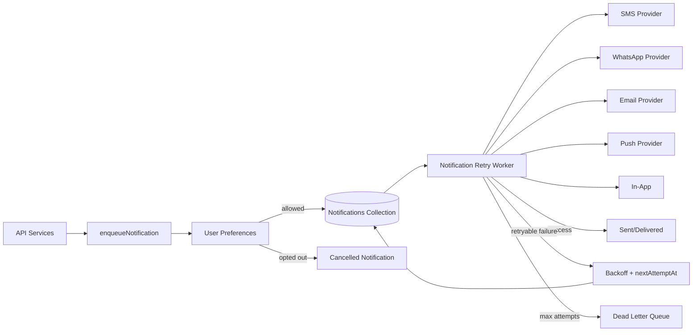

# Notifications Architecture

## Channels
- `sms`
- `whatsapp`
- `email`
- `push`
- `in_app`

## Delivery Tracking
- `status`
- `attempts`
- `maxAttempts`
- `nextAttemptAt`
- `sentAt`
- `deliveredAt`
- `failedAt`
- `deadLetterAt`
- `failureReason`
- `providerResponse`

## Preference Rules
- Transactional notifications default to enabled.
- Marketing notifications default to disabled.
- Opt-out creates a `cancelled` notification record for auditability.
- Exhausted retries move the notification to `dead_letter`.
